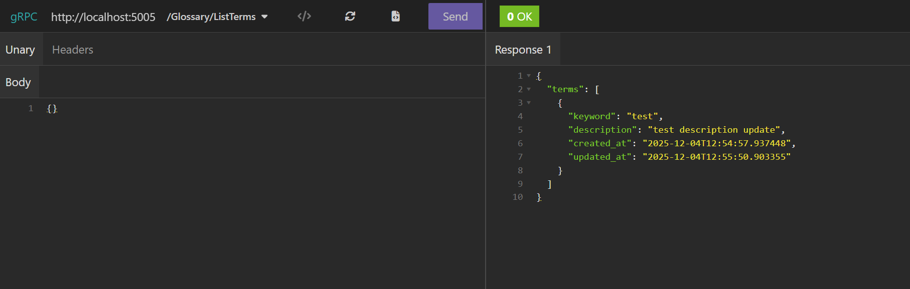
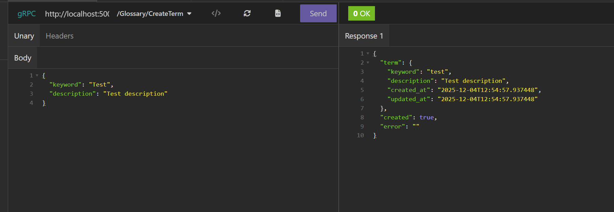
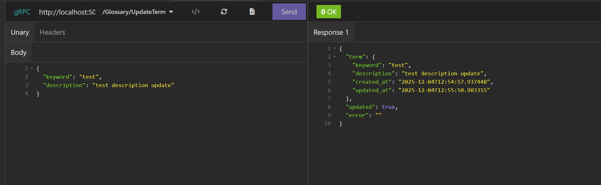
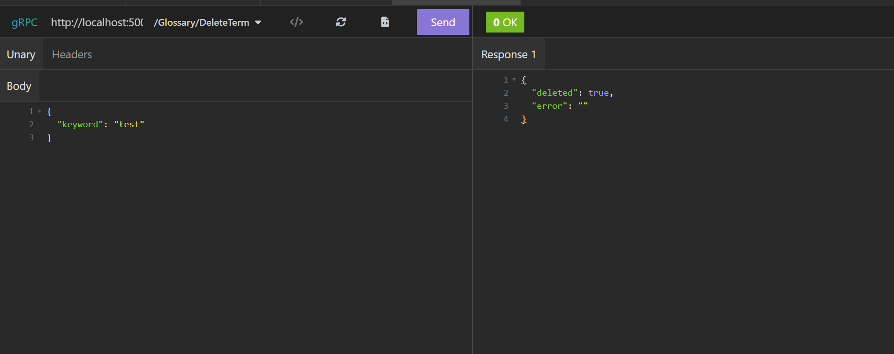

# Запуск Docker контейнера

### Сборка контейнера

```commandline
docker build -t glossary-grpc
```

### Запуск контейнера

```commandline
docker run -p 50051:50051 glossary-grpc
```

# API

1. Получение списка терминов

```
    /Glossary/ListTerms
```



2. Добавление нового термина

```
    /Glossary/CreateTerm
```



3. Обновление термина

```
    /Glossary/UpdateTermin
```



4. Удаление термина

```
    /Glossary/DeleteTerm
```

